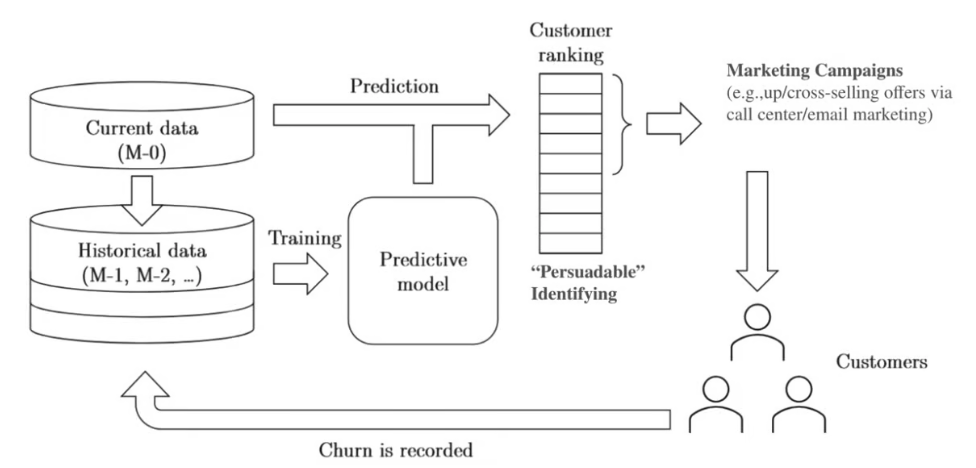

# mlzoomcamp

## Problem Statement  
Customer churn poses a significant challenge for businesses, especially in the telecommunication (telecom) industry (Verhelst et al., 2021). While companies frequently launch campaigns to keep customers from leaving, it is challenging to target the right customers due to the balance between saving marketing budget and avoiding customer annoyance.

## Objective
The objective is to identify customers at risk of leaving thus make informed data for tailored churn reduction strategies.

## Approach
Leverage machine learning models to develop a churn prediction model. The process involved:

(1) Data preparation with import, clean and transform data to feature engineer and EDA.  
(2) Meticulous steps in pre-processing data (e.g., encoding, scaling, feature selection), and  
(3) Then model selection to figure out which model as the most effective model  
(4) Last, model assessment to evaluate the model's ability to predict churn on unseen data based on key metrics including Accuracy, Precision, Recall, and F1 scores

## Churn Prevention Framework
Provide a holistic framework to translate customer data into actionable marketing tactics to prevent customer churn.

*Adapted from Verhelst et al., 2021*
## Data Source
Taken from Kaggle: https://www.kaggle.com/blastchar/telco-customer-churn/download
